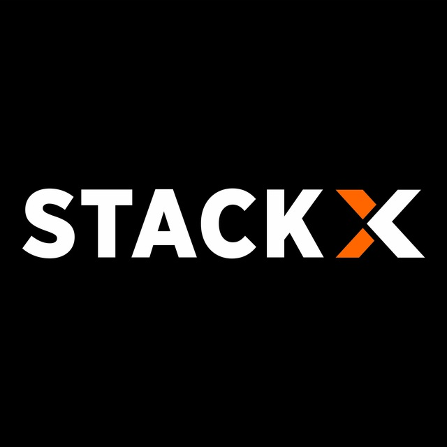
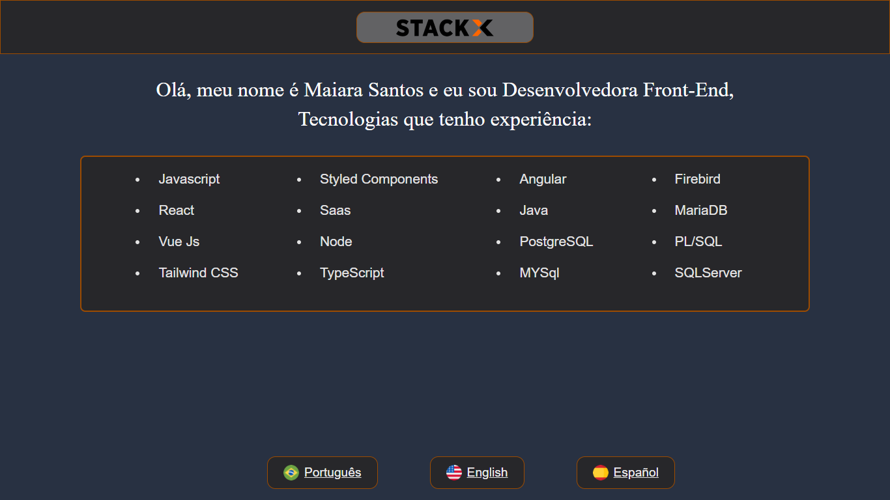

<div align="center">
 
 # DESAFIO STACKX

</div>

🌐 Trago-lhe aqui três Projetos que faz parte do Módulo Web 3.0 do curso para `Desenvolvedor Full Stack da 

Editech StackX`. O conceito destas aplicações,  serão três  Single Page Aplication, aplicadas em <i>`React`,
 
 `Angular`,`Vue.js`</i>. Cada uma foi estruturada dentro de suas particularidades e seus conceitos utilizados 
 
 conforme a demanda dos Frameworks, Bibliotecas e Linguagens manuseados. Estarei apresentando o primeiro Projeto feito em React
 
 <br>
 
# <div align="center">💻 [Clique aqui para acessar o Portal](https://stackx.com.br/)
 
 
 
 ***
 
 
 
 </div>
 
 ***
 
 # 🌐 Desafio 01 React
 
 ➡ Esta aplicação foi construida em `Reactts`, utilizando a plataforma `Vitets` que é um bundler, onde 
 
 consegue usar compiladores e frameworks direto  da caixa,  além da criação de hot module e replacement dentro 
 
 do Projeto.
  
  <br>
  
  # <div align="center">💻 [Clique aqui para acessar o Projeto](https://desafioweb30-react.netlify.app/)
   
   ***
   
   
   
   ***
   
   ### 🌐 Criação do Projeto
   
   #
   
   
   ➡ ```create vite @latest```, utilizado no PowerShell sendo uma ferramenta de linha de comando que ajuda a 
   
   interagir complataforma online, navegadores e servidores.
 
 #
 
  ### 🌐 Abrir o Projeto no Terminal
   
   #
   
   
   ➡ ```code .```, Aplicar este comando no PowerShell para ter acesso ao Projeto no VsCode.
 
 #
 
  ### 🌐 Corrigir Configurações no arquivo TSX
   
   #
   
   
   ➡ ```yarn add --dev @types/react```, Identifica certos tipos de problemas antes mesmo de executar o código, 
   
   melhorando o fluxo do desenvolvimento e corrigindo automaticamente os erros.
 
 #
 
  ### 🌐 Executando o comando NPM
   
   #
   
   
   ➡ ```npm install ```, NPM (Node Package Manager) é um controle onde iremos instalar o 
   
   gerenciador de dependências e seus pacotes, através de linhas de comandos, interagindo 
   
   com o repositório existente.
 
 #
 
  ### 🌐 Instalando o Styled Component
   
   #
   
   
   ➡ ```npm install --save styled-components```, é uma biblioteca em React ou React Native 
   
   que nos permite criar components de estilo ao escrever códigos `CSS` dentro de um arquivo 
   
   `JavaScript`.
 
 #
 
  ### 🌐 Instalendo o ícone do Projeto
   
   #
   
   
   ➡ ``` npm add @types/styled-components -D```, Utiliza este comando no Projeto, apropriando 
   
   e depurando um determinado  caso de uso,  formatando os components e dando rollup para construir 
   
   o Package .
 
 #
 
  ### 🌐 Instalando a requisição Axios
   
   #
   
   
   ➡ ``` npm install axios```, que é um `cliente HTTP`, baseado em promises para fazer requisições, podendo 
   
   ser utilizado tanto no navegador, quanto no Node.js.
 
  #
 
  # 🌐 Informações adicionais
   
   ### 🌐 Props
 
 #
   
   
   ➡`` PROPS`` é um objeto  com dados que retorna um elemento React. Chama-se `Components de função`, porque são 
   
   literalmente  atribuição ao JavaScript. São argumentos para uma funcionalidade dentro de um component react e 
   
   rendeiriza os parâmetros que  deseja dar a ele.
